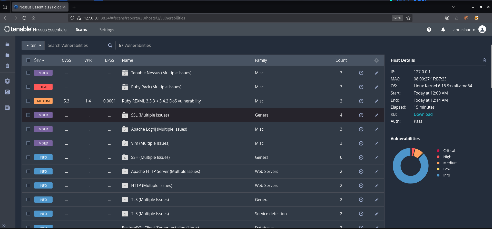

# Task 3: Basic Vulnerability Scan Using Nessus

## Objective
Perform a basic vulnerability assessment on a local Kali Linux system using Nessus Essentials to identify security weaknesses and document findings.

---

## Environment
- OS: Kali Linux
- Scanner: Nessus Essentials
- Target: 127.0.0.1
- Scan Type: Basic Network Scan

---

## Tools Used
- Nessus Essentials
- Kali Linux
- Firefox Browser

---

## Installation & Setup

wget https://www.tenable.com/downloads/api/v2/pages/nessus/files/Nessus-10.x.x-debian10_amd64.deb  
sudo dpkg -i Nessus-10.x.x-debian10_amd64.deb  
sudo apt --fix-broken install -y  
sudo systemctl start nessusd  
sudo systemctl enable nessusd  

---  

## 6. Critical Vulnerabilities

### Vulnerability 1
- **Name:** Ruby RACK DoS Vulnerability  
- **Severity:** High
- **CVE:** CVE-2025-46727  
- **Description:**   The version of the RACK Ruby library installed on the remote host is prior to 2.2.14 / 3.0.16 / 3.1.14 . It is, therefore, affected by a DoS vulnerability where an attacker can trigger denial of service by sending specifically crafted HTTP requests, which can cause memory exhaustion or pin CPU resources, stalling or crashing the Rack server. This results in full service disruption until the affected worker is restarted.
- **Impact:**  Remote attackers can crash or freeze Ruby-based web services, causing denial of service and service downtime.
- **Solution:**  Upgrade to RACK version 2.2.14 / 3.0.16 / 3.1.14 or later.

### Vulnerability 2
- **Name:**  
- **Severity:** High  
- **CVE:**  
- **Description:** 
- **Impact:**  
- **Solution:**  

---

## 7. Screenshots

- **Screenshot 1:** Scan Overview  
- **Screenshot 2:** Vulnerability List  
- **Screenshot 3:** Vulnerability Details  

> Place your images below:

```markdown



