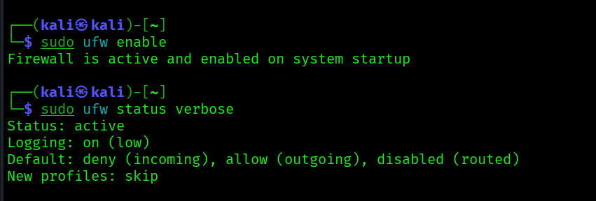
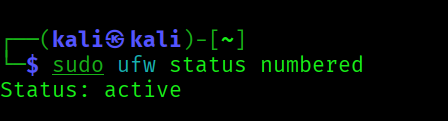
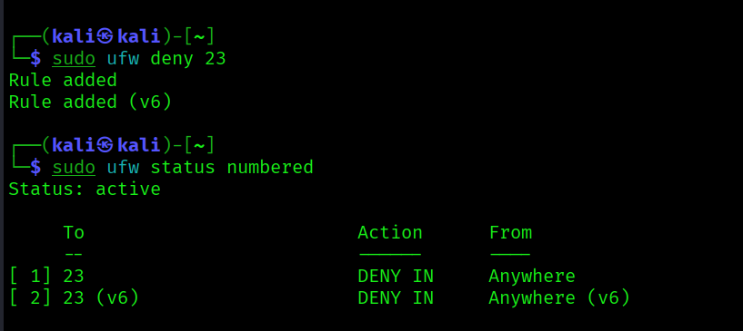
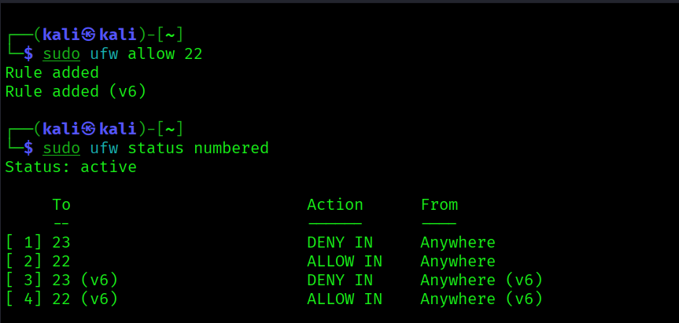
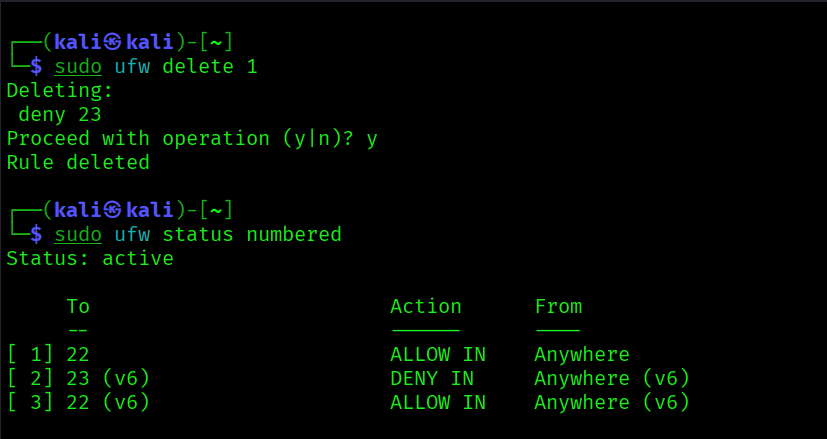

# Task 4 – Setup and Use a Firewall on Kali Linux (UFW)

## Objective

Configure and test basic firewall rules to allow or block network traffic using UFW (Uncomplicated Firewall) on Kali Linux.

---

## Tools Used

- Kali Linux  
- UFW (Uncomplicated Firewall)  
- Telnet Client  

---

## Step 1: Install and Enable UFW

sudo apt update  
sudo apt install ufw -y  
sudo ufw enable  
sudo ufw status  

  

Firewall status shows **active**, confirming UFW is enabled.

---

## Step 2: View Current Firewall Rules

sudo ufw status numbered  

  

Displays all existing firewall rules with numbering.

---

## Step 3: Block Telnet Port (23)

sudo ufw deny 23  
sudo ufw status numbered  

  

This rule blocks inbound traffic on port 23 (Telnet).

---

## Step 4: Test the Block Rule

telnet localhost 23  

  

This confirms that port 23 is successfully blocked.

---

## Step 5: Allow SSH Port (22)

sudo ufw allow 22  
sudo ufw status numbered  

This ensures SSH access remains available.

---

## Step 6: Remove Test Block Rule

Delete rule :  
sudo ufw delete <rule_number>  
sudo ufw status

Port 23 no longer appears.

----

## How Firewall Filters Traffic

UFW is a frontend for iptables that filters incoming and outgoing packets based on defined rules.
Each packet is checked against rules in order and matched with actions such as:  

- ALLOW – permits traffic
- DENY – silently blocks traffic
- REJECT – blocks and sends response

Firewalls reduce attack surface by restricting unnecessary services and allowing only trusted communication.

  

