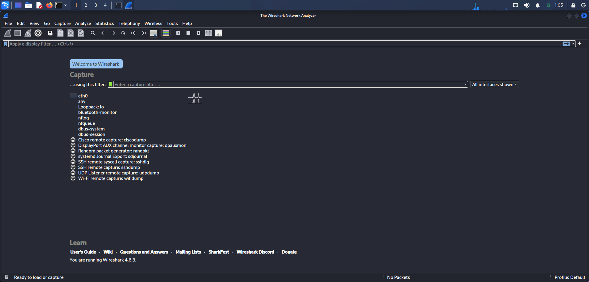
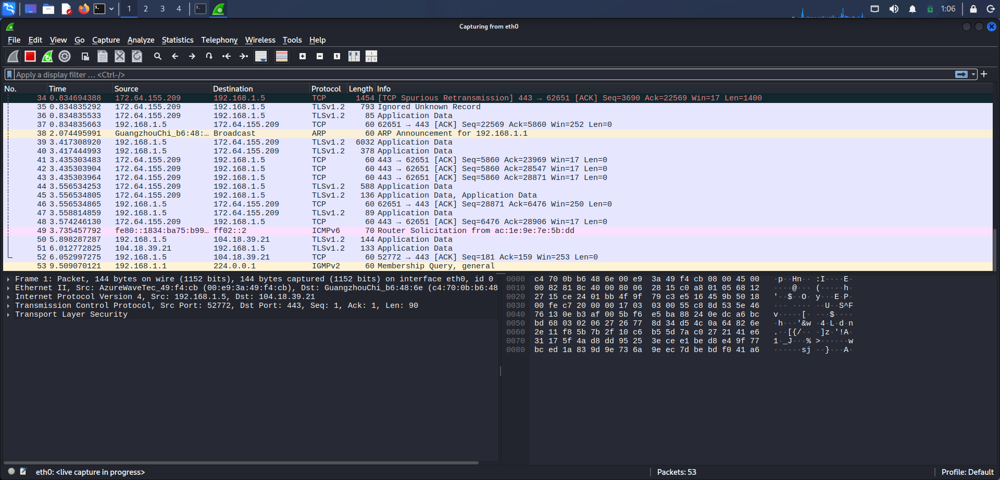

# Wireshark Packet Capture and Protocol Analysis

## Objective
Capture live network traffic using Wireshark, identify multiple protocols, apply filters, and analyze packet details.

---

## Tools Used
- Kali Linux
- Wireshark
- Terminal

---

## Installation

- sudo apt update
- sudo apt install wireshark -y
- sudo usermod -aG wireshark $USER
- reboot

---

## Procedure

### 1. Launch Wireshark
   - wireshark
  
Selected active interface (eth0).

### 2. Start Capture

Clicked blue shark fin icon. 

### 3. Generate Traffic  

- ping google.com

Visited:
- https://google.com

### 4. Stop Capture

Clicked red stop button.

### 5. Apply Filters and Identified Protocols

 - http:

 - dns:

 - tcp:

 ### 6.Export Capture

File → Save As → capture.pcap

---

## Packet Analysis

### DNS Packet
- Resolves domain name to IP address.
- Uses UDP port 53.

### TCP Packet
- Connection-oriented communication.
- Three-way handshake (SYN, SYN-ACK, ACK).

### HTTP Packet
- Client requests web resources.
- Server responds with status code.

---

## Findings

- Multiple protocols coexist in normal browsing.
- DNS always occurs before HTTP/HTTPS.
- TCP transports HTTP data.

---

# Conclusion

### Wireshark successfully captured and displayed live network traffic. Filtering and analysis confirmed the presence of multiple protocols and demonstrated basic network communication flow.
