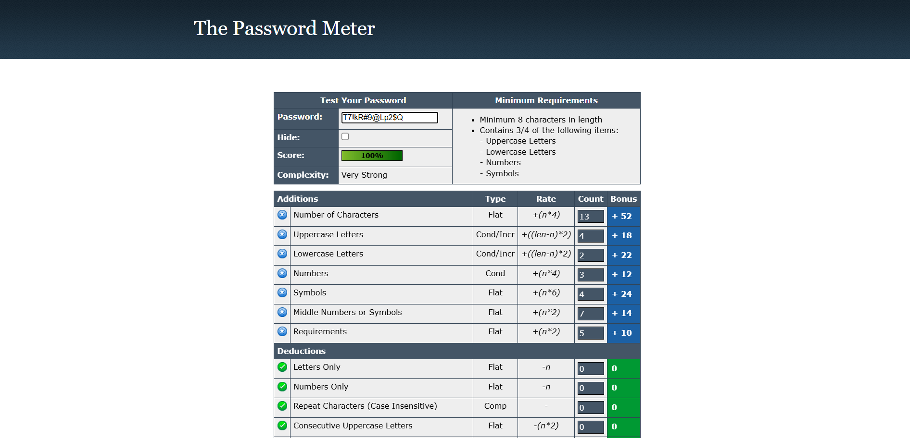

# Password Strength Evaluation Report

## 📌 Objective
To analyze how password complexity affects security by testing different types of passwords using online password strength checkers.

---

## 🛠 Tools Used
- PasswordMeter (https://passwordmeter.com)
- HowSecureIsMyPassword (https://howsecureismypassword.net)

---

## 🔐 Step 1: Create Password Samples

| Password | Type |
|--------|------|
| password | Very Weak |
| Password123 | Weak |
| P@ssw0rd123 | Medium |
| T7!kR#9@Lp2$Q | Strong |

---

## 🔍 Step 2: Test Passwords

### Password: password
Strength: Very Weak  
Feedback: Too short, common word  

Screenshot:  

---

### Password: Password123
Strength: Weak  
Feedback: Add symbols and more length  

Screenshot:  

---

### Password: P@ssw0rd123
Strength: Medium  
Feedback: Increase length  

Screenshot:  

---

### Password: T7!kR#9@Lp2$Q
Strength: Strong  
Feedback: Good password  

Screenshot:  

---

## 📊 Observations
- Short passwords fail quickly
- Adding symbols improves strength
- Longer passwords are much stronger

---

## 🧠 Best Practices
- Use at least 12–16 characters  
- Combine uppercase, lowercase, numbers, and symbols  
- Avoid personal information  
- Use password manager  

---

## ⚔ Common Password Attacks

### Brute Force Attack
Tries all possible combinations.

### Dictionary Attack
Uses common words list.

### Credential Stuffing
Uses leaked usernames and passwords.

---

## 📝 Conclusion
Password complexity greatly increases security. Longer and random passwords take years or centuries to crack compared to simple passwords which break in seconds.

---

## 👤 Author
Anns Shanto

