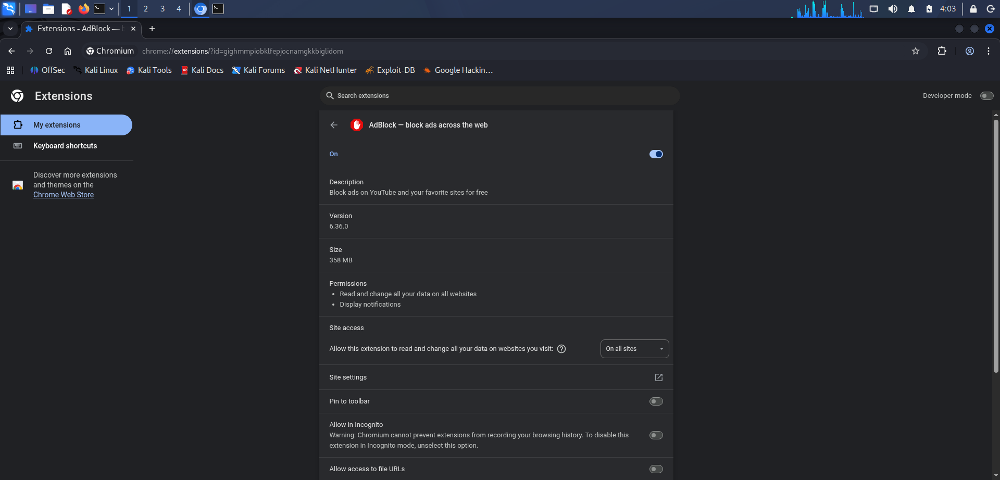
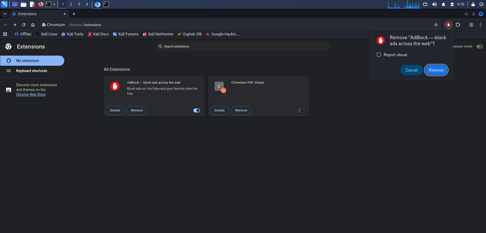

# Browser Extension Security Audit

## Objective
Identify and remove potentially harmful browser extensions.

## Environment
- OS: Kali Linux
- Browser: Google Chrome
- Date: 23 Feb 2026

---

## Step 1: Open Extension Manager

URL:
```
chrome://extensions/
```

Screenshot:


---

## Step 2: Review Installed Extensions

| Extension Name | Developer | Permissions | Suspicious? |
|---------------|-----------|------------|-------------|
| Ad Block | Unknown dev | Read all site data | YES |
| Dark Reader | Dark Reader Ltd | Limited | NO |
| Chromium PDF | Chrome | No special permission | NO |  

[extention](screenshots/extention.png)

---

## Step 3: Suspicious Extension Identified

Extension: Ad Block  
Reason:
- Unknown publisher
- Excessive permissions
- Low rating

Screenshot:


---

## Step 4: Removed Extension

Action:
Removed via extension manager.

Screenshot:


---

## Findings

1 suspicious extension removed.

---

## How Malicious Extensions Harm Users

- Data theft
- Credential harvesting
- Session hijacking
- Ad injection
- Browser hijacking

---

## Conclusion

System cleaned and browser performance improved.
