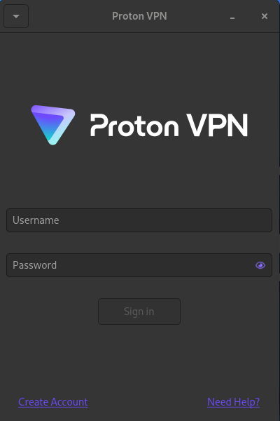
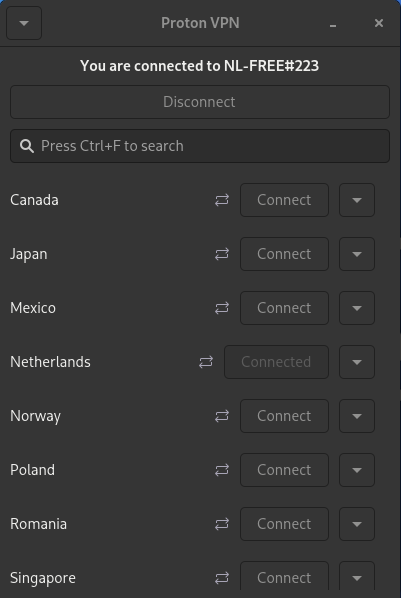
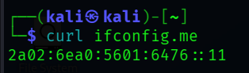
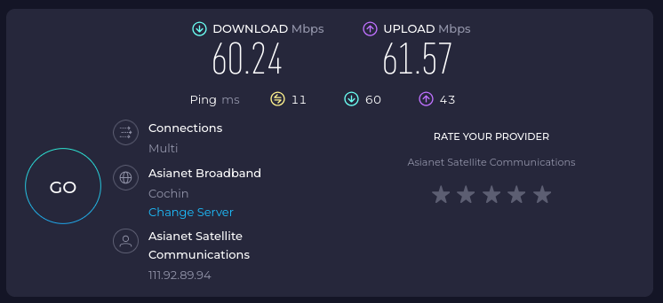
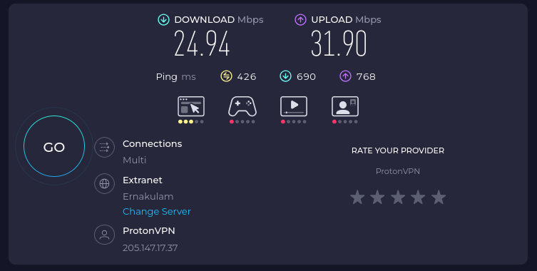
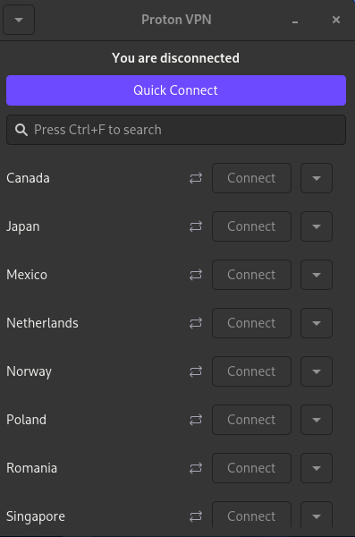

# VPN Setup and Privacy Verification on Kali Linux

## Objective
Understand the role of VPNs in protecting privacy and securing communication by encrypting traffic and masking IP address.

---

## Tools Used
- Kali Linux 2025
- ProtonVPN (Free Tier)

---

## Step 1: Update System
- sudo apt update && sudo apt upgrade -y
  

## Step 2: Install ProtonVPN
- wget https://repo.protonvpn.com/debian/dists/stable/main/binary-all/protonvpn-stable-release_1.0.6_all.deb
- sudo dpkg -i protonvpn-stable-release_1.0.6_all.deb
- sudo apt update
- sudo apt install proton-vpn-gnome-desktop -y

  
## Step 3: Login to ProtonVPN  
Opened ProtonVPN application and logged in with free account.

  

  
## Step 4: Connect to VPN  
Connected to nearest free server.
  

  
## Step 5: Verify IP Address
### Before VPN:  
curl ifconfig.me  
  

  
### After VPN:
curl ifconfig.me  
  

  
## Step 6: Verify Encrypted Browsing
Opened HTTPS website and confirmed lock icon.
  

  
## Step 7: Speed Test Comparison
### Without VPN:
speedtest-cli
  

  
### With VPN:
speedtest-cli
  

  
## Step 8: Disconnect VPN

  

---

## Observations
- VPN changes public IP address.
- Traffic is encrypted.
- Internet speed decreases slightly when VPN is active.

---

## VPN Benefits
- Hides IP address
- Encrypts data
- Protects on public Wi-Fi
- Prevents tracking
- VPN Limitations
- Reduced speed
- Free plans have server limits
- VPN provider must be trusted

---

# Conclusion
### VPNs significantly improve privacy and security by encrypting internet traffic and masking user identity.
